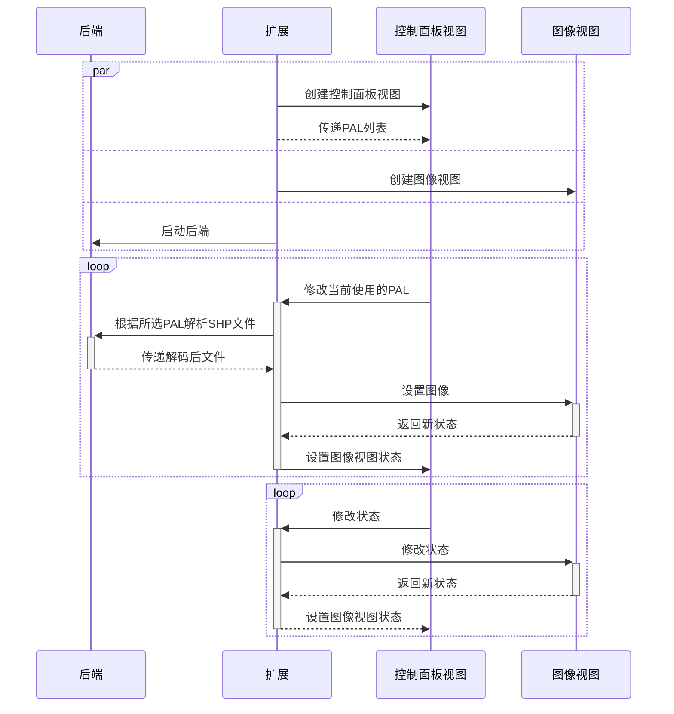

# SHP 查看器

SHP查看器分为两部分

1. 图像视图
2. 控制面板视图

其中，图像视图用于展示图像（或动画），控制面板视图用于控制图像视图中展示的内容。

### 流程

```mermaid
sequenceDiagram
  participant b as 后端
  participant e as 扩展
  participant c as 控制面板视图
  participant v as 图像视图

par
  e->>c: 创建控制面板视图
  e-->>c: 传递PAL列表
and
  e->>v: 创建图像视图
and
  e->>b: 启动后端
end

loop
  c->>+e: 修改当前使用的PAL
  e->>+b: 根据所选PAL解析SHP文件
  b-->>-e: 传递解码后文件
  e->>+v: 设置图像
  v-->>-e: 返回新状态
  e->>-c: 设置图像视图状态
end

loop
  c->>+e: 修改状态
  e->>+v: 修改状态
  v-->>-e: 返回新状态
  e-->>-c: 设置图像视图状态
end

```
