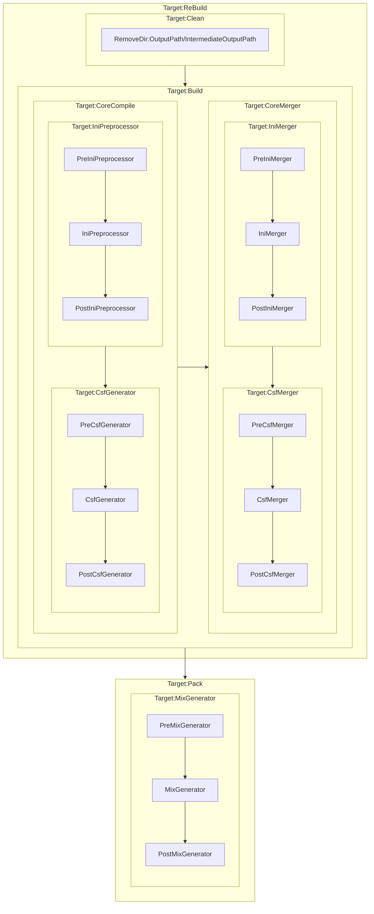

# Shimakaze.Sdk.RA2

适用于RA2的MSBuild Sdk

## 属性
|属性名|作用|
|:-:|:-|
|ShimakazeSdkPath|指定Shimakaze.Sdk的位置|
|UseDefaultItems|是否使用默认的Items|
|Configuration|使用的配置，通常是`Debug`或`Release`|
|Platform|目标平台，通常是`Vanilla`|
|BaseIntermediateOutputPath|`obj`|
|IntermediateOutputPath|`$(BaseIntermediateOutputPath)\$(Configuration)`|
|BaseOutputPath|`bin`|
|OutputPath|`$(BaseOutputPath)\$(Configuration)`|
|ShimakazeSdkExclude|默认被排除的文件 `$(BaseOutputPath)\**\*;$(BaseIntermediateOutputPath)\**\*`|

## 项
- `IniFile` 表示一个将要被处理的INI文件
  - `Ignore` 表示这个文件不需要被处理
  - `TargetFile` 表示最终合并后的文件
  - `Intermediate` 表示文件中间产物的位置
  - `Pack` 表示文件会被打包到Mix文件中
  - `TargetPack` 表示文件会被打包到这个Mix文件中
- `IntermediateIniFile` 表示Ini文件的中间产物
  - `TargetFile` 表示最终合并后的文件
  - `Pack` 表示文件会被打包到Mix文件中
  - `TargetPack` 表示文件会被打包到这个Mix文件中
- `FinalIniFile` 最终合并后的Ini文件
  - `Pack` 表示文件会被打包到Mix文件中
  - `TargetPack` 表示文件会被打包到这个Mix文件中
- `CsfFile` 表示一个将要被处理的CSF文件
  - `Ignore` 表示这个文件不需要被处理
  - `TargetFile` 表示最终合并后的文件
  - `Intermediate` 表示文件中间产物的位置
  - `Pack` 表示文件会被打包到Mix文件中
  - `TargetPack` 表示文件会被打包到这个Mix文件中
  - `Type` 表示文件的类型
- `IntermediateCsfFile` 表示Csf文件的中间产物
  - `TargetFile` 表示最终合并后的文件
  - `Pack` 表示文件会被打包到Mix文件中
  - `TargetPack` 表示文件会被打包到这个Mix文件中
- `FinalCsfFile` 最终合并后的Csf文件
  - `Pack` 表示文件会被打包到Mix文件中
  - `TargetPack` 表示文件会被打包到这个Mix文件中
- `MixAssetsFile` 一定会被打包的文件
  - `TargetPack` 表示文件会被打包到这个Mix文件中

## 任务
|任务名|描述|
|:-:|:-|
|TaskCsfGenerator|CSF生成器
|TaskCsfMerger|CSF合并器
|TaskIniMerger|INI合并器
|TaskIniPreprocessor|INI预处理器
|TaskMixGenerator|MIX生成器

## 目标

- CoreCompile
- CoreMerger
- Build
- Pack
- Clean

- PreIniPreprocessor
- IniPreprocessor
- PostIniPreprocessor

- PreIniMerger
- IniMerger
- PostIniMerger

- PreCsfGenerator
- CsfGenerator
- PostCsfGenerator

- PreCsfMerger
- CsfMerger
- PostCsfMerger

- PreMixGenerator
- MixGenerator
- PostMixGenerator

## 任务顺序

## 默认 Defines
通常情况下，我们会默认定义以下Define：
- 完全大写的 Configuration 如 `DEBUG` 或 `RELEASE`
- 完全大写的 Platform 如 `VANILLA`